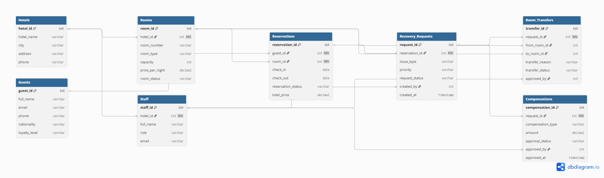
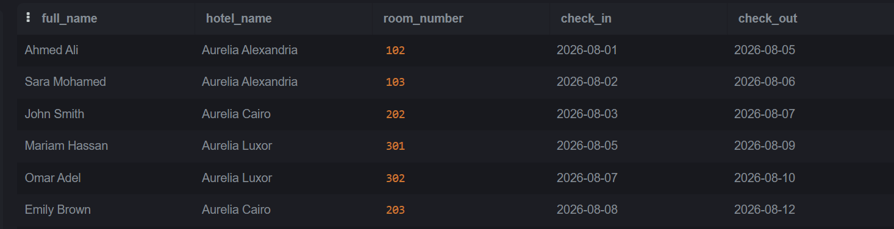
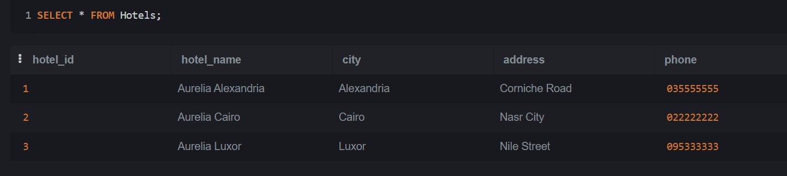
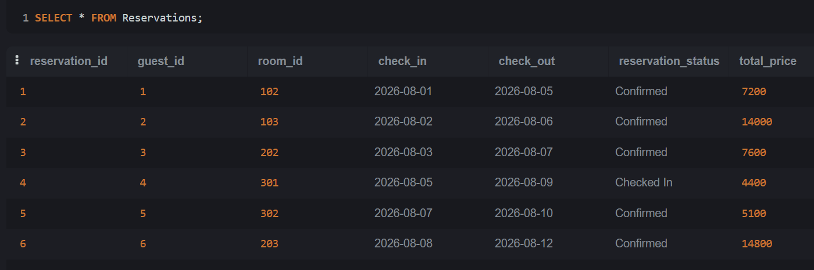
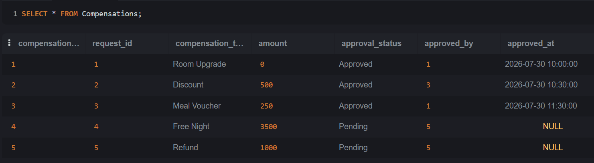

#  Aurelia Hotels & Resorts MCP

An AI-powered hotel recovery management system built using the **Model Context Protocol (MCP)**. The project helps hotel staff manage overbooking incidents, recovery requests, room transfers, and guest compensation through an intelligent AI agent connected to an MCP server and a relational database.

---

#  Overview

Aurelia Hotels & Resorts MCP integrates three main components:

- **MCP Server** – Provides hotel resources and tools through the Model Context Protocol.
- **AI Agent** – Uses Google Gemini to perform reasoning, invoke tools, and automate hotel recovery workflows.
- **Database** – Stores hotel operational data, reservations, recovery requests, room transfers, and compensations.

Together, these components create an intelligent hotel recovery system capable of handling real-world overbooking scenarios.

---

#  Features

- Hotel Management
- Reservation Management
- Overbooking Resolution
- Recovery Requests
- Room Transfers
- Guest Compensation
- AI-Powered Decision Making
- MCP Client-Server Communication
- SQLite Database

---

#  Team Responsibilities

| Team Member | Responsibility |

| **Nour Mohamed** | MCP Server Development |
| **Sama Sherif** | Database Design, SQL Schema, ERD, Seed Data, Compensation Policy, `approve_compensation` Tool |
| **Nourhan Ahmed** | AI Agent Development |
---

# 🗂️ Project Structure

```text
Aurelia-Hotel-MCP
├── agent/
├── mcp_server/
├── db/
├── tools/
├── MCP.py
├── main.py
└── README.md
```

---

#  MCP Server

The MCP Server exposes hotel services and resources through the Model Context Protocol.

### Responsibilities

- Tool Management
- Resource Management
- Prompt Management
- Capability Negotiation
- Notifications
- Database Connectivity
- Request Processing

---

#  AI Agent

The AI Agent communicates with the MCP Server and uses Google Gemini to automate hotel recovery operations.

### Features

- Dynamic Tool Discovery
- Gemini Function Calling
- Resource Reading
- Prompt Execution
- Notification Handling
- Human Approval (Elicitation)
- Sampling Support

---

#  Database Module

The database was designed to support hotel recovery workflows and maintain data consistency.

### Database Tables

- Hotels
- Rooms
- Guests
- Staff
- Reservations
- Recovery_Requests
- Room_Transfers
- Compensations

### Database Design

- Relational Database
- Primary & Foreign Keys
- Normalized Schema
- Sample Seed Data
- Compensation Policy

---

#  Compensation Tool

### `approve_compensation()`

This MCP tool validates guest compensation requests before approval by applying defensive business rules.

**Validation includes:**

- Request existence
- Duplicate approval prevention
- Approval authorization
- Compensation amount validation
- Policy compliance

---

# 📊 Database Screenshots

## Entity Relationship Diagram



---

## Database Overview



---

## Hotels Table



---

## Reservations Table



---

## Compensations Table



---

# ⚙️ Technologies

- Python
- SQLite
- SQL
- Model Context Protocol (MCP)
- Google Gemini
- asyncio
- JSON-RPC 2.0
- Git
- GitHub

---

#  Getting Started

### Clone the repository

```bash
git clone https://github.com/your-username/Aurelia-Hotel-MCP.git
```

### Install dependencies

```bash
pip install -r requirements.txt
```

### Run the MCP Server

```bash
python main.py
```

### Run the AI Agent

```bash
python -m agent.demo --auto
```

---

#  Project Objective

Develop an intelligent hotel recovery platform that combines AI, MCP, and relational databases to automate recovery workflows, improve guest satisfaction, and support hotel staff in resolving overbooking situations efficiently.

---

#  License

This project was developed for academic purposes as part of the **Faculty of Computer and Data Science – Alexandria University**.ث3
